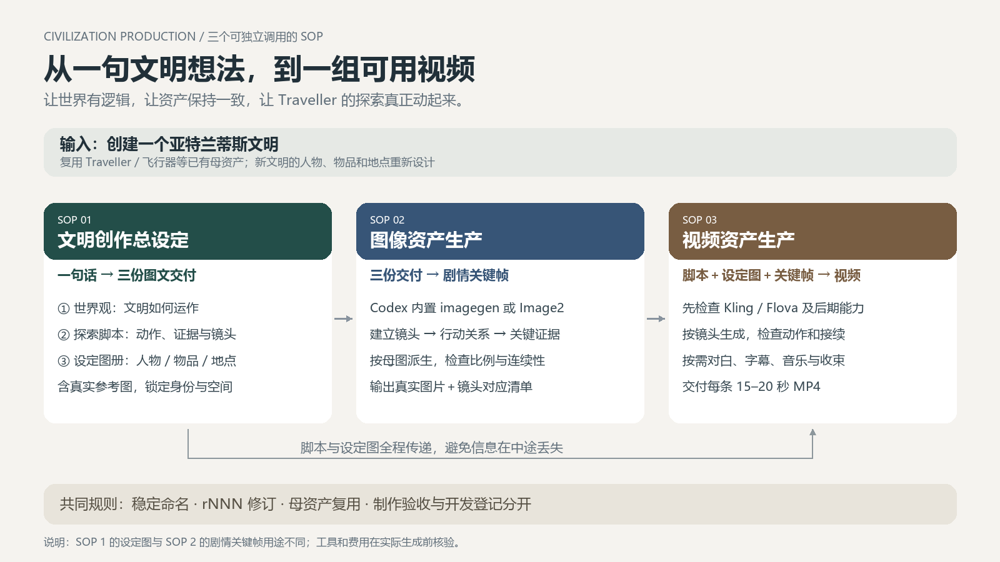

# 图文导览 · 从文明想法到视频资产

这套流程让每个故事节点在三个阶段保持同一份身份、空间和剧情依据。先看下方图解，再进入详细操作手册。

## SOP 1 · 把一句想法，变成可制作的文明

[阅读本阶段逐步操作手册](../project_034_skill_civilization-blueprint/.agents/skills/civilization-blueprint/references/operations-manual.md) · [下载矢量详图](sop-1-illustrated.svg)

**设定图与剧情图不同。** 此阶段先回答文明如何运作，再锁定人物、物品与地点长什么样。图册必须包含真实图片；没有生成工具时只能交付明确标注的准备稿。

| 你需要的信息 | 在完整手册哪里找 |
|---|---|
| 每步工具、输入与输出 | 第一节逐步操作表 |
| 文件格式与参数 | 第二节：含默认值和能力限制 |
| 可复制提示词 | 第三节：生成与返修模板 |
| 合格判断 | 第四节质量闸门 |
| 常见失败与返工 | 第五节：症状、修法、重验范围 |
| 命名与版本 | 第六节：制作引用、rNNN和稳定运行时路径 |
| 单节点所需资产 | 第七节及配套node-assets.json |

## SOP 2 · 把设定图册，变成连续剧情图像

[阅读本阶段逐步操作手册](../project_035_skill_civilization-image-assets/.agents/skills/civilization-image-assets/references/operations-manual.md) · [下载矢量详图](sop-2-illustrated.svg)

**一张图承担一个叙事任务。** 建立镜头交代空间，行动图表现关系，证据图支持剧情判断。帧数以动作覆盖为准，不机械要求每个节点都生成三张。

| 你需要的信息 | 在完整手册哪里找 |
|---|---|
| 每步工具、输入与输出 | 第一节逐步操作表 |
| 文件格式与参数 | 第二节：含默认值和能力限制 |
| 可复制提示词 | 第三节：生成与返修模板 |
| 合格判断 | 第四节质量闸门 |
| 常见失败与返工 | 第五节：症状、修法、重验范围 |
| 命名与版本 | 第六节：制作引用、rNNN和稳定运行时路径 |
| 单节点所需资产 | 第七节及配套node-assets.json |

## SOP 3 · 把剧情关键帧，变成可用短视频

[阅读本阶段逐步操作手册](../project_036_skill_civilization-video-assets/.agents/skills/civilization-video-assets/references/operations-manual.md) · [下载矢量详图](sop-3-illustrated.svg)

**生成成功不等于成片合格。** 平台回执、实际文件、完整解码和视听验收分别检查。18秒是交付目标，不能直接假定所选模型支持单次生成18秒。

| 你需要的信息 | 在完整手册哪里找 |
|---|---|
| 每步工具、输入与输出 | 第一节逐步操作表 |
| 文件格式与参数 | 第二节：含默认值和能力限制 |
| 可复制提示词 | 第三节：生成与返修模板 |
| 合格判断 | 第四节质量闸门 |
| 常见失败与返工 | 第五节：症状、修法、重验范围 |
| 命名与版本 | 第六节：制作引用、rNNN和稳定运行时路径 |
| 单节点所需资产 | 第七节及配套node-assets.json |
