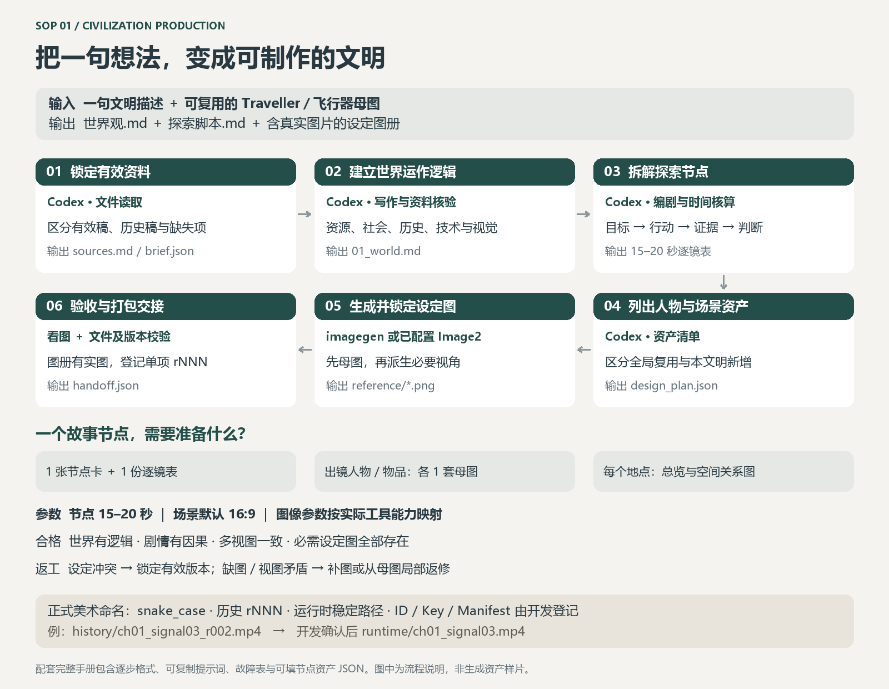

# SOP 1 操作手册 · 一句话到文明制作总设定




手册版本 1.3。节点指一个具有目标、行动和认知变化的故事单元；本流程将其默认映射为一条15–20秒视频。更长事件拆成多个节点，不强行塞入一条短片。所有参数为制作目标，API参数以当前工具schema为准。

## 一、逐步操作：工具、输入、输出、参数与放行

| 步骤 | 使用工具 | 输入格式 | 操作与参数/模板 | 输出格式 | 合格标准 |
|---|---|---|---|---|---|
| 1 读取并锁定来源 | Codex文件读取、rg；遇DOCX/PDF加载对应读取技能 | 一句话TXT/聊天；MD/DOCX/PDF；PNG/JPG旧母图 | 项目ID、输出根目录；来源按有效/历史/冲突/缺失分类；不按日期猜版本 | `sources.md`、`brief.json` | 旧稿与有效稿区分；记录开发命名输入；未知登记为pending |
| 2 建立世界逻辑 | Codex文字推理；涉及真实历史时使用官方/学术来源检索 | brief.json与有效源文档 | 使用模板W；默认完整探索弧，章节数按内容；覆盖下列世界维度 | `01_world.md` | 世界维度齐全；每项核心机制有边界、代价及可见后果 |
| 3 剧情和逐镜规划 | Codex写作＋时间表核算；可用Python做秒数求和 | 世界MD、可复用实体列表 | 模板S；每节点15–20秒；默认3个镜头，按动作增减 | `02_story.md`、逐节点镜头表JSON | 时间无空档/重叠；证据先于结论；时空/视角正确；动作可完成 |
| 4 资产拆解与生成预检 | Codex清单处理＋imagegen工具发现；或已配置Image2技能/CLI帮助 | 剧本、旧图PNG/JPG、世界风格 | 内部实体引用、视图列表、真实参考文件；确认参考编辑、预算与输出位置 | `design_plan.json`、参考映射、缺项表 | 每镜人物/道具/地点均有内部制作引用；复用图真实存在；收费条件与权限覆盖 |
| 5 制作实际设定图 | Codex内置imagegen或用户指定Image2；查看图像工具 | 设定提示词TXT、参考图 | 模板D；角色正侧背/物件结构/地点总览；先母图后派生；参数表见下 | `reference/*.png`或JPG、生成记录JSON | 固定特征和视图相互一致；物件可读、场景空间可定位；不能只交提示词 |
| 6 编图册与交接 | Codex Markdown编辑、图片查看、文件哈希；可用仓库校验器 | 实际设定图、世界、脚本、资产表 | 核对图册内嵌路径与文件；状态逐项登记 | `03_design_atlas.md`、`handoff.json`、`qa/blueprint_review.md` | 三主文档完整；实体图全覆盖；节点可执行；未查看图片不标视觉passed |

## 二、输入输出格式与参数

主文档为UTF-8 Markdown，实际图片PNG优先，照片参考允许JPG；DOCX/PDF只作输入或按用户要求的附加导出。三文档与JSON字段必须遵循 [交接契约](handoff-contract.md)。

`brief.json`最小模板：

```json
{"project_id":"atl","idea":"创建一个亚特兰蒂斯文明","story_snapshot":"story_001","language":"zh-CN","target_segment_seconds":18,"aspect_ratio":"16:9","global_reference_files":[],"status":"planned"}
```

| 参数 | 默认/填法 | 判断或限制 |
|---|---|---|
| 文明内容规模 | 覆盖地理生态、资源经济、治理阶层、日常生活、信仰习俗、技术边界、历史、地区路线、视觉、危险退路 | 不用字数替代完整性；每个主要地区写用途/居民/供给/材料/尺度/遗留痕迹 |
| 章节与节点数量 | 按故事规模声明；仅有一句话时可从5–7章提案起步 | 自动补全内容，不自动扩大收费生成数量 |
| 节点时长 | 15–20秒；示例18秒 | 分镜时间必须覆盖目标时长 |
| 设定图视图 | 角色至少可辨识全身母图；反复出镜补正侧背；物件补关键结构；场景总览和空间关系 | 单幅可多视图，但每个视图必须清楚且一致；不要求看不到的正脸 |
| 图像比例 | 人物/物件设定按视图选1:1或3:2；场景默认16:9 | 是目标画布，不保证每个接口都支持；按实际工具合法值映射 |
| 图像尺寸 | 建议长边≥1536像素，关键细节可辨优先 | 不支持时记录实际尺寸；不可虚报为2K/4K；避免仅靠放大宣称细节提高 |
| seed/quality/model | 仅在工具公开支持时设置并记录 | 不承诺固定seed可以保证人物一致；内置工具未返回型号就写not_reported |
| 图片参考 | 真实附加已有母图，注明身份/空间/风格各自作用 | 不允许仅写文件名冒充输入参考 |

## 三、可复制提示词模板

### W 世界观

```text
根据文明想法{idea}，创作{civilization_name}的完整设定。
有效资料为{source_list}；保留{global_invariants}；其余未知项可自主创作并标明。
按地理生态→资源循环→生产交通→治理阶层→生活习俗→历史矛盾→技术边界→地点路线→视觉语法构建因果关系。
每项机制写明能力、代价、失效方式、普通人的应对和镜头中能看见的证据。
每个主要地区给相对位置、用途、供给、尺度、材料、当前状态和历史痕迹。
视觉必须体现{civilization_specific_features}，不能套用旧文明的{inappropriate_old_features}。
输出01_world.md，并检查核心机制是否能进入剧情或美术设计。
```

### S 探索脚本

```text
依据{world_snapshot}，让Traveller围绕{goal}展开探索。
每节点写：目标、阻力、行动、可见证据、判断改变、代价与下一步。
作者知道的真相与Traveller此时知道的线索分开；结局证据应提前出现。
每节点{15_to_20}秒，每镜给起止秒、时代、摄影者、景别、主体动作、环境响应、首末状态、内部实体引用、关键帧引用、接镜和声音。
不要把复杂拿取/递交/开启压进一秒，不用旁白解释替代全部动作。
输出完整故事及可直接给生图和视频工具使用的逐镜表。
```

### D 设定图与返修

```text
生成{entity_ref}的{view_role}设定图，用于后续跨镜头身份一致性。
参考1定义{identity_features}，参考2定义{geometry_or_material}。
保留{locked_features}；允许变化仅{allowed_state_changes}。
文明风格{style_rules}，展示{required_views_and_details}，尺度参照{scale_anchor}。
地点图明确{entrance_main_structure_exit_light_sources}；人物图不得擅自显露被遮挡的脸。
图片本身清楚可读，标签可在图册后期排版。不要生成剧情帧代替结构设定。
返修时只修{failed_region_or_feature}，保留{already_passed_features}。
```

## 四、质量闸门

必须逐项填写passed/failed/unverified及证据：世界维度覆盖、机制自洽、剧情因果、知识揭示顺序、镜头秒数、空间连续、母图身份、图册文件、节点资产覆盖。任一必要项failed或unverified不能把整个handoff标passed。工具受限时交付明确的blocked准备稿。

## 五、常见失败与返工

| 问题 | 如何确认 | 返工方法 | 重验范围 |
|---|---|---|---|
| 文明只有宏大名词 | 无法解释水/食物/能源或日常生活 | 补资源与维护逻辑，并落到人物行动和可见细节 | 世界→受影响剧情与地点图 |
| 新旧故事混用 | 事件原因或地点功能互斥 | 锁有效源，列冲突，重写受影响段 | 更新剧情快照并标依赖下游stale |
| 图册只有文字 | design_files为空或链接不存在 | 在授权内生成真实图；缺工具则标blocked | 图册、清单、依赖节点 |
| 多视图比例矛盾 | 正侧背结构或尺寸不同 | 从已通过母图参考编辑派生 | 同实体全部视图 |
| 复用角色被重新设计 | 服饰、遮脸或装置改变 | 重附全局母图，只改文明相关环境 | 所有引用此错误版本的图 |
| 节点动作太多 | 分镜秒数不够或事件没有因果 | 降低动作数量或拆成多个15–20秒节点 | 脚本、节点清单与后续预算 |
## 六、文件命名与版本规则

本阶段按 [美术命名与交付规则](art_naming.md) 执行，覆盖此前的组合编号文件名与v号约定。

| 内容 | 本阶段执行规则 |
|---|---|
| 正式文件/目录 | 小写ASCII＋数字＋下划线；snake_case；小写扩展名 |
| 文件结构 | `<asset_name>[_<variant>]_<role>[_rNNN].<ext>`；无意义的main及不存在的variant省略 |
| 历史/源文件 | r001起，三位递增；如`history/ch01_signal03_r002.mp4`；不覆盖旧历史 |
| 运行时文件 | 如`runtime/ch01_signal03.mp4`，通常不带修订号；名称/路径由开发确认 |
| 设定/关键帧 | 如`reference/traveller_preview_r001.png`；仅制作参考，不自动进入运行时 |
| 角色词 | 使用source/preview/thumbnail/albedo/normal等已有词；新的角色先与开发确认 |
| 开发登记 | Asset ID、Asset Key、Runtime Path及Manifest由开发管理，未知为null/pending |
| 制作清单 | handoff.json、image_delivery.json、video_delivery.json；不是开发Manifest |
| 单项修订 | 各资产独立rNNN；剧情依据用story_snapshot；契约版本与美术Revision分开 |
| 修改/新增 | 同用途通常保持名称及注册标识，只递增Revision；共存/不同用途提请开发确认 |
| 不确定 | 文稿与参考准备照常，登记待确认项；未确认不得标运行时发布完成 |

正式美术资源命名不改变Codex必要的SKILL.md及连字符技能标识。所有图片/视频/音频/3D规格与来源信息见命名规则及节点模板。日期只写交付信息，不作为资产修订号。

## 七、单个故事节点所需资产清单

| 资产 | 最少数量/规则 | 复用还是新增 | 本阶段交付 |
|---|---|---|---|
| 节点卡 | 1 | 新增 | 目标、行动、证据、结论、前后节点JSON/MD |
| 世界规则引用 | ≥1组 | 引用世界文档 | 明确本节点展示哪项文明机制 |
| 逐镜执行表 | 覆盖15–20秒，通常2–4镜 | 新增 | 镜头引用、精确时段、动作/首末态/声音 |
| Traveller母图 | 出镜则1套；纯环境节点可不需要 | 复用全局已锁定图 | 路径、版本、固定特征；POV手套也算出镜 |
| 飞行器/通用设备母图 | 每种实际出镜实体1套 | 优先复用 | 与Traveller相同记录规则 |
| 文明角色设定 | 每种新角色1套 | 首次新增，以后复用 | 可辨身份与必要角度 |
| 关键物品设定 | 每种推动动作/证据的物品1套 | 首次新增 | 结构、状态、尺度及操作部位 |
| 地点设定 | 每个实际地点1套 | 首次新增 | 总览、入口出口和关键结构位置 |
| 状态差异表 | 1份 | 新增节点状态 | 湿度、破损、持物、灯态等 |

对应的可填机器清单见 [节点资产模板](node-assets.json)。数量按“节点实际出镜”计算，共用母图只引用一次，不重复收费生成。

### 本节点交付登记补充

每项实际资产登记asset_name、用途、独立rNNN、新增/修改、source/runtime/preview/reference/history、依赖、软件版本、媒介规格与来源授权。developer_registration缺失时保持pending；内部节点和镜头引用不是正式Asset ID。设定/关键帧默认reference，成片先history，开发确认后才提供稳定runtime导出。

### 命名失败与返工

| 问题 | 处理 | 重验 |
|---|---|---|
| 大写/连字符/中文或临时版本词 | 生成命名提案，不擅自改已注册名称 | 路径引用和重名检查 |
| runtime带修订号、混入源文件 | 历史移入制作包history，稳定导出候选交开发确认；不移动真实游戏目录 | source/runtime/preview边界 |
| 清单误当Manifest或自行分配ID | 改为delivery制作记录；未知开发字段置pending/null | 开发确认记录 |
| 同用途返修误建新资产 | 保留已确认名称/Key/Path，增加该资产rNNN | 对比上次正式交付 |
| 缺少来源/规格/依赖 | 补充可验证信息，未知不能写通过 | 逐项交付信息 |
