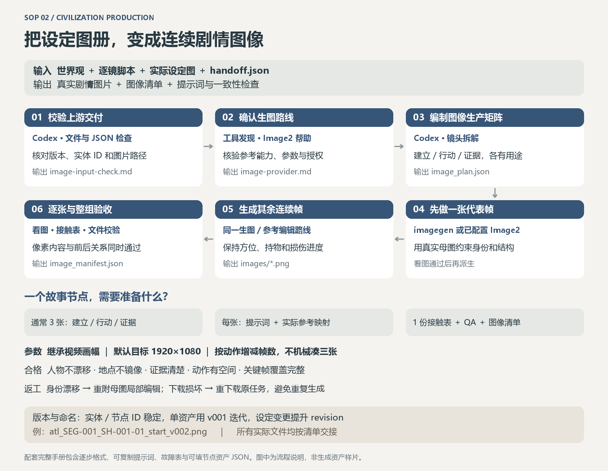

# SOP 2 操作手册 · 设定包到剧情图像资产




手册版本v1.1。节点与ID继承SOP1；不要为同一角色或节点另建不兼容编号。

## 一、逐步操作：工具、输入、输出、参数与放行

| 步骤 | 使用工具 | 输入格式 | 操作与参数/模板 | 输出格式 | 合格标准 |
|---|---|---|---|---|---|
| 1 接收与校验 | Codex文件读取、JSON检查；仓库校验器可选 | 三份MD、designs PNG/JPG、handoff.json | 核对project_id/revision与每镜实体引用 | `qa/image-input-check.md` | 必需母图真实存在且passed；缺图列具体ID |
| 2 检查生图路线 | 宿主imagegen工具发现；或Image2技能与CLI帮助 | 用户指定路线、参考能力要求、授权范围 | 检查是否支持编辑/多参考、实际参数、输出路径；不打印密钥 | `qa/image-provider.md` | 所选路线可用；服务商与预算明确；不自动切换 |
| 3 编制节点生产矩阵 | Codex编剧/美术拆解、JSON/CSV编辑 | 脚本镜头、实体母图、地点布局 | 模板P；逐镜分配首/动作/证据/末态所需图片 | `image_plan.json`或CSV；逐图TXT | 每个keyframe_id有用途；同组非无意义重复 |
| 4 生成代表帧 | imagegen或已配置Image2；图片查看 | 完整提示词、实际参考图 | 模板I；先关键建立帧，按参数表合法映射 | 1张实际PNG/JPG及回执JSON | 人物/物件/地点一致，构图支持后续动作 |
| 5 派生连续帧 | 同一路线生图/编辑工具 | 母图＋通过代表帧＋对应动作指令 | 模板I/E；每次只改变所需机位或状态 | `images/*.png`、完整prompt、task记录 | 首中末变化有因果，固定几何不漂移 |
| 6 像素与连续性验收 | 图片查看；Pillow或等效尺寸/接触表工具 | 单张原图、母图、相邻帧 | 按下列视觉检查表核对；失败局部编辑 | `qa/image-review.md`、接触表 | 每张被检查；关键证据可读；没有假字幕/UI/边框 |
| 7 交接 | Codex JSON编辑、SHA256、文件存在检查 | 通过图、上游三文档与图册 | 登记实际尺寸、来源版本、工具返回模型信息 | `image_manifest.json`＋实际图片 | 所有必需关键帧为passed；无失效引用；未确认项显式列出 |

## 二、输入输出格式与参数

JSON遵循 [交接契约](handoff-contract.md)。图像原件PNG优先或高质量JPG；逐图prompt用UTF-8 TXT；可附CSV清单，但JSON为机器交接基准。

以下是规范化制作字段，**不是可直接提交的API请求**：

```json
{"keyframe_id":"KF-001-01-A","shot_id":"SH-001-01","frame_role":"start","aspect_ratio":"16:9","target_long_edge_px":1920,"provider":"host-imagegen","model":"not_reported","reference_files":[],"reference_roles":[],"seed":null,"prompt_file":"prompts/atl_KF-001-01-A_v001.txt","output_path":"images/atl_SEG-001_SH-001-01_start_v001.png","status":"planned"}
```

| 参数 | 建议默认值 | 必须注意 |
|---|---|---|
| 比例 | 继承视频目标，默认16:9 | 不能只改文件名而不检查实际比例 |
| 尺寸 | 目标1920×1080或平台支持的相近高质量尺寸 | 生成后记实测值；尺寸不同先判断裁切是否破坏构图，不直接拉伸 |
| 每节点帧数 | 3张起步：建立、行动、证据/收束 | 每个镜头需要可执行输入；若多镜/动作复杂可4–6张；单镜可首/末2张 |
| 母图参考 | 人物、物件、地点各取当前镜头相关项 | 超过接口上限则选主参考或拆任务；记录实际送入了哪些 |
| 连续性参考 | 同时保留母图，可加相邻合格帧 | 不让随机漂移在长链中累积 |
| seed、quality、n | 仅实际接口支持时填写；默认单张验证 | 不编造内置工具不支持的字段，不以seed取代母图 |
| 重试 | 沿用授权次数/预算；默认不无限重试 | 下载失败复用原任务；重复视觉失败先修改条件 |

内置imagegen的具体参考字段按宿主工具定义选择；拥有本地路径时实际传入参考路径，无路径时使用宿主支持的会话图片引用。Image2先确认提供方与已安装适配器，不把任意模型名拼成可执行命令。

## 三、可复制提示词模板

### P 节点图像生产矩阵

```text
读取{script_revision}的{segment_id}，按每镜动作拆成图像生成任务。
对每张列出：keyframe_id、用途、shot_ids、entity_ids、实际参考路径及角色、构图、首末状态、尺寸、下一步动态。
每张承担不同叙事职责；保留{world_features}，禁止提前揭露{later_information}。
仅规划本节点必需图像，不自动扩展数量。
```

### I 首帧/连续帧生成

```text
生成{segment_id}/{shot_id}/{keyframe_id}，用途是{frame_role}。
输入参考1用于{entity_id固定身份}；参考2用于{location空间}；参考3用于{相邻帧连续状态}。
保持{locked_features}；当前{era}，摄影机由{camera_owner}在{position}朝{direction}拍摄。
画面开始状态{start_state}，主体{姿态/持物}，环境{天气/照明/状态}。
必须清晰呈现{evidence}，为下一动作{next_motion}保留{movement_space}。
采用{civilization_style}，满幅{aspect_ratio}；禁止{specific_risks}。
```

### E 局部返修

```text
以这张已生成图为编辑底图，以{master_image}为身份/结构基准。
只修正{region}的{error}为{desired_feature}。
保留已通过的{camera_composition_lighting_other_subjects}；不得重新设计整个人物或载具。
完成后重新检查修正处及它与相邻帧的关系。
```

## 四、合格标准

每张必须通过：身份特征一致；人物/载具尺度合理；地点入口出口/光源方向一致；手部、持物和损伤状态连续；关键证据确实可辨；机位能支持下步动作；文明材料与风格吻合；实际尺寸/比例/解码正确。质检记录逐项写证据；单张通过不等于整组连续性通过。

## 五、常见失败与返工

| 问题 | 判定 | 返工方法 | 重验范围 |
|---|---|---|---|
| 换脸/换服装/多喷口 | 对照母图固定特征不符 | 附正确母图局部编辑；错误图不作下镜唯一参考 | 当前图及引用它的后续图 |
| A/B/C几乎一样 | 未体现不同动作/证据用途 | 重写景别、机位或证据任务，重新生成缺失职责 | 节点覆盖表 |
| 地点镜像/入口移动 | 场景拓扑与布局图冲突 | 使用地点总览限定拍摄位置，不盲目镜像整个图 | 前后镜空间连贯 |
| 档案变成纸卡/边框 | 内容没有满幅 | 编辑去除边框并保持主体，重验裁切 | 当前图与视频可用画幅 |
| 关键证据太小 | 正常观看看不清 | 单独生成证据近景；保留可识别空间锚点 | 证据镜及其接镜 |
| 后续动作无空间 | 肢体被裁断或主体堵在边缘 | 扩展/重新构图保留动作方向空间 | 当前首帧和动作可达性 |
| 任务超时/下载损坏 | 尚无终态或文件无法解码 | 先查原任务/重下载同资源，确认失败再按预算重试 | 文件完整性，避免重复扣费 |
## 六、文件命名与版本规则

- project_id 使用短英文文明码，如 `atl`；故事节点 `SEG-001`，镜头 `SH-001-01`，关键帧 `KF-001-01-A`。ID一经分配不因返修改变，删除的ID不复用。
- 全局实体 `GLOBAL-TRAVELLER` / `GLOBAL-CRAFT`；文明实体 `ATL-CHAR-001` / `ATL-PROP-001` / `ATL-LOC-001`。只在实际出镜或参与因果时纳入节点资产。
- 文件模式：`{project_id}_{entity_or_segment_id}_{role}_v{NNN}.{ext}`。例如 `atl_ATL-LOC-001_layout_v001.png`、`atl_SEG-001_SH-001-01_start_v002.png`、`atl_SEG-001_final_v003.mp4`。使用ASCII文件名便于跨平台命令，中文解释写在清单中。
- 世界/脚本/图册及清单保留契约固定入口名，例如 `01_world.md`、`handoff.json`；每次正式修订前将旧文件归入 `revisions/r001/`，新入口指向同一份最新有效内容。文档首部写 project_id、revision、updated_at、status、变更说明。
- `revision` 是整套制作的契约修订号（示例 `r1`→`r2`）；`v001` 是某项资产的迭代号。只修某帧构图但不改变世界/身份/剧情时提升文件v号并更新清单，不必重写全部世界设定。改变人物身份、地点拓扑或剧情事实时提升revision，并逐项标记受影响下游 `stale`。
- 保留原始文件，失败版登记failed原因，合格版本登记passed与SHA256。不要使用“最终版2_最终确认版”等模糊命名，不以最新修改时间自动选取版本。
- 所有引用是production根目录相对路径。日期采用ISO格式，文本UTF-8。缓存、下载、中间文件与交付均服从使用者指定根目录；外部工具若无法指定落盘位置，先明确限制，不静默违反路径规则。
- 开源仓库版本与制作revision分开：本次手册为v1.1，不能把仓库v1.1误当某文明资产revision。

## 七、单个故事节点所需资产清单

| 资产 | 数量/条件 | 来源 | 本阶段结果 |
|---|---|---|---|
| 节点脚本与世界规则 | 各1份引用 | SOP1 | 继承，不另造事实 |
| 实体母图及地点布局 | 每个出镜实体1套 | SOP1 | 带版本/路径；跨节点共享不再生成 |
| 建立/动作/证据关键帧 | 默认3张，最终以脚本镜头覆盖为准 | 本阶段生成 | PNG/JPG实图，各有稳定ID |
| 首末帧 | 按视频后端输入要求与动作复杂度 | 可与上行重合，不重复计数 | 若后端不接受末帧，保留为验收目标 |
| 每图提示词及参考映射 | 每图1份 | 本阶段 | TXT＋JSON，记录实际送入的参考 |
| 生成回执 | 每个提交1份 | 工具 | 任务ID、返回状态、实测尺寸；私密字段不发布 |
| 节点接触表与QA | 各1份 | 检查产物 | 所有帧与母图对照、问题与返修版本 |
| 图像交接清单 | 1份更新 | 本阶段 | 所需keyframe_id全覆盖且passed |

见 [节点资产模板](node-assets.json)。数量采用去重后的文件ID统计，不能把同一图同时当首帧和证据图而重复算生成张数。
