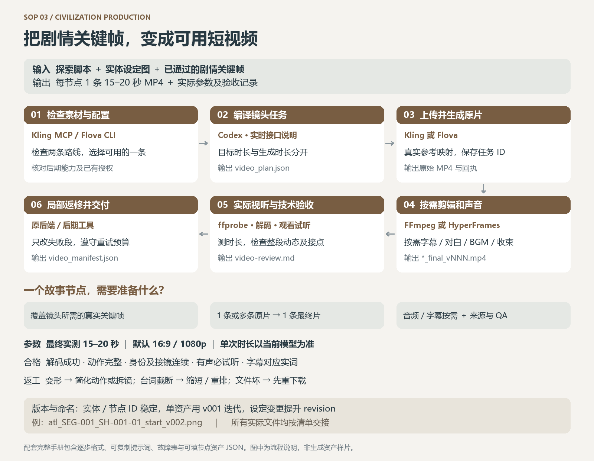

# SOP 3 操作手册 · 剧情关键帧到15–20秒视频




手册版本v1.1。以下参数区分制作目标与平台请求；不会把某次历史接口上限当永久能力。

## 一、逐步操作：工具、输入、输出、参数与放行

| 步骤 | 使用工具 | 输入格式 | 操作与参数/模板 | 输出格式 | 合格标准 |
|---|---|---|---|---|---|
| 1 接收素材 | Codex文件读取、JSON校验、图片查看 | 剧本/图册MD、handoff/image_manifest JSON、真实PNG/JPG | 检查版本、passed状态、必要图像ID | `qa/video-input-check.md` | 所需关键帧和母图可读且通过；无stale |
| 2 核验环境和权限 | Kling MCP who_am_i；Flova version/auth status；所选路线账户项目只读查询；FFmpeg/HyperFrames帮助 | 用户路线、目标时长/画幅、预算授权 | 分别记录发现/连接/登录/能力；实际生成只需一条后端 | `qa/preflight.md` | 接口能力、材料上传、后期与授权支持本次具体任务 |
| 3 编译任务 | Codex镜头拆解、平台实时schema/CLI帮助 | 逐镜脚本、图片、参考映射 | 模板V/F；生成时长与最终时长分开；填实际合法参数 | `video_plan.json`、逐任务prompt TXT、请求JSON | 时间表可执行；长于平台上限的目标已拆片；报价条件明确 |
| 4 上传与生成 | Kling file_upload＋image_to_video；或Flova上传/聚合run（按当前帮助） | 兼容图片副本、脚本、准确映射、授权任务 | 选择已确认模型；保存任务ID；按现有任务等待 | 原始MP4、请求/回执JSON、费用记录 | 真实媒体资源成功；不能仅凭文本completed判定出片 |
| 5 剪辑与声音 | FFmpeg；或HyperFrames入口＋general-video/core/cli；需要声音时media-use/audio | 原片MP4、可选音频WAV/MP3、实词字幕SRT | 正常速度按脚本拼接；按需混音/字幕/结尾；不得靠黑屏凑秒 | `videos/*_final_vNNN.mp4`、可选SRT | 最终15–20秒；动作、声音完整；无多余硬切 |
| 6 文件与视听验收 | ffprobe、FFmpeg全解码；视频查看/逐帧检查；音频播放；有字幕时ASR辅助 | 最终MP4及脚本/母图 | 检查真实时长/尺寸；观看全段及接点；试听全段 | `qa/video-review.md`、测量JSON/日志 | 下列硬性门槛全通过；未观看/试听不能宣称全通过 |
| 7 返修与交接 | 原后端局部再生成或已授权编辑；SHA256、JSON工具 | 问题定位、原始素材、预算剩余 | 按失败表选择重下载/剪辑/重生成；保留原片 | video_manifest JSON、MP4、可选字幕与来源清单 | 节点ID完整覆盖；来源与实测参数可追溯 |

实际Kling工具前缀随宿主变化，使用当前发现的同名能力。Flova具体上传/运行flags先查帮助；加载可用flova技能的运行生命周期，禁止拼造CLI参数。

## 二、输入输出格式与参数

清单按 [交接契约](handoff-contract.md)。以下是任务规划JSON，不是供应商原始API请求：

```json
{"segment_id":"SEG-001","target_final_seconds":18,"provider":"kling-or-flova","model":"resolve-from-current-capabilities","generated_parts_seconds":[10,8],"aspect_ratio":"16:9","target_width":1920,"target_height":1080,"fps_policy":"preserve_or_explicitly_convert","native_audio":false,"reference_files":[],"spoken_text":"","subtitle_mode":"none","budget":{"estimate":null,"authorized_budget":null,"actual_charge":null},"status":"planned"}
```

这里10+8只是拆分示意，不代表任何平台必然支持这两个长度；也不是默认要求生成两段。能用单次15秒讲完整就无需拆片。

| 参数 | 目标/默认 | 使用要求 |
|---|---|---|
| 最终时长 | 每条15–20秒，默认15秒 | 以实际MP4测量；不是以prompt或请求值验收 |
| 单次生成时长 | 当前模型允许范围内 | 先查schema；18–20秒可由多个有连续动作的原片装配 |
| 分辨率/画幅 | 默认1920×1080、16:9，用户可改 | 实测；1920×1088等尺寸须记录并谨慎裁切；禁止拉伸伪装 |
| 帧率 | 尽量继承原片；混合素材明确统一到24/25/30之一 | 不默默改变动作速度；记录转换 |
| 参考图数量/大小 | 平台支持范围内 | 超限制作兼容副本，保留母图；记录实际输入映射 |
| 多镜/首尾帧/运镜字段 | 当前模型明确支持才使用 | 不支持的字段不能塞入arguments；可转为提示词意图，但不得宣称等价强控制 |
| 原生音频 | 默认遵循脚本；未要求时不添加对白 | 需要时指定实际文本、角色、情绪、声音环境；生成后听辨 |
| 字幕/BGM | 按用户要求；默认不额外添加 | 有字幕需对实词；音乐有合法来源；Flova不具备字幕能力时采用明确的后期流程 |
| 交付编码 | 推荐MP4/H.264；有音频推荐AAC | 合法可解码为底线；必要转换写入edit_notes |
| 费用与重试 | 沿用当前任务明确授权 | 估算/授权/实际分开；余额差不当账单；未定终态不重复提交 |

本地技术核验命令模板（路径作为独立参数正确引用；本机需先发现可执行工具）：

```text
ffprobe -v error -show_entries format=duration:stream=codec_type,codec_name,width,height,r_frame_rate,sample_rate -of json "INPUT.mp4"
ffmpeg -v error -i "INPUT.mp4" -map 0:v:0 -map 0:a? -f null -
```

这些命令仅核验技术文件，不能证明人物、口型或剧情正确。

## 三、可复制提示词模板

### V 视频动作任务

```text
制作{segment_id}，最终目标{target_seconds}秒；本次生成部分{part_id}长{supported_seconds}秒。
参考映射：{reference_index_to_entity_and_frame}。保持{locked_geometry_and_identity}。
时代{era}，摄影机由{camera_owner}持有；开始状态{start_state}。
{t0}-{t1}秒：{camera_motion}，主体{action1}，环境{response1}。
{t1}-{t2}秒：{action2}，清晰呈现{evidence}。
末尾：{end_action_and_state}，与下段{next_state}衔接。
声音：{exact_words_or_no_dialogue}，表演{voice_and_emotion}，环境{ambience}。
禁止{specific_failure_modes}；不要增加额外人物/摄影设备/随机切镜。
```

### F Flova有边界任务

```text
使用本项目已上传并确认可读的脚本、实体设定图和{segment_id}关键帧。
仅制作这个节点，交付{15_to_20}秒视频；保持{invariants}，执行{shot_schedule}。
使用{confirmed_model_or_route}，声音按{audio_plan}，不得生成{out_of_scope_media}。
本次授权范围为{existing_budget_and_retry_scope}。先按已明确的能力和费用条件执行，不扩展节点数量。
请返回实际媒体资源和本轮完成/失败/待决状态；文字规划完成不算视频完成。
```

### R 动态返修

```text
{segment_id}的{time_range}出现{observed_failure}。
保留{passed_shots_and_audio}，从{approved_source_frame}修正{one_action_or_geometry}。
新末态必须接上{next_start_state}，保持{screen_direction_and_prop_state}。
仅修该段，费用和重试仍受{authorization_scope}约束。
```

## 四、合格标准

硬性门槛：每条实测15–20秒；文件非空、全片解码无错误；尺寸/比例符合约定；没有未授权的循环、冻帧、黑尾凑时长；实体身份和几何稳定；动作有起因与完成；摄影者、时代、屏幕方向及持物状态连续；剧情证据可辨。每镜首中尾和全部接点抽检之外，还要观看整条动态。

有声音时全段试听，无台词截断、明显错词、音量抢对白或异常爆音；有字幕时对应实际说出的词且时间无重叠、末条不超片尾。口型需实际视听对照，不能凭音轨一致宣称嘴形同步。纯静音明确标silent，不要求虚构音轨。无法观察的项目标unverified。

## 五、常见失败与返工

| 问题 | 判定 | 返工方法 | 重验范围 |
|---|---|---|---|
| CLI已登录但项目不可读 | 身份/项目只读查询失败 | 核对账户和项目权限，不改私有端点；保持任务未提交 | 账户/项目预检 |
| 20秒参数被拒 | schema不支持所请求长度 | 改合法原片时长，拆动作后接续或选已授权兼容模型 | 时长、动作与预算 |
| 上传成功但平台未见参考 | 回执成功但资源不可读/创作反馈未引用 | 查同一资源，在原项目补正确材料引用，不重建一堆项目 | 输入映射及后续生成 |
| 手部/机体变形或多出设备 | 整段观看发现结构变化 | 简化动作，用正确母图重做相关段；必要时拆镜 | 当前段及相邻接点 |
| 台词截断/口型不符 | 实际试听/观看与脚本冲突 | 缩短文本、重排镜长或预算内重生成；不硬贴未念出的字幕 | 整条声音/字幕与口型 |
| 下载0字节/损坏 | 下载终态后非空检查或解码失败 | 等原下载完成/重下载同任务，先不重生成 | 文件完整性 |
| 衔接跳变或成片太短 | 方位/持物不符，或实测<15秒 | 用兼容首末态重剪/局部再生成；不拉长静帧冒充 | 接点及整条时长 |
| BGM太大/字幕遮证据 | 试听与画面检查不通过 | 仅改混音/字幕位置字号，尽量保留合格画面 | 音轨、字幕与最终解码 |
## 六、文件命名与版本规则

- project_id 使用短英文文明码，如 `atl`；故事节点 `SEG-001`，镜头 `SH-001-01`，关键帧 `KF-001-01-A`。ID一经分配不因返修改变，删除的ID不复用。
- 全局实体 `GLOBAL-TRAVELLER` / `GLOBAL-CRAFT`；文明实体 `ATL-CHAR-001` / `ATL-PROP-001` / `ATL-LOC-001`。只在实际出镜或参与因果时纳入节点资产。
- 文件模式：`{project_id}_{entity_or_segment_id}_{role}_v{NNN}.{ext}`。例如 `atl_ATL-LOC-001_layout_v001.png`、`atl_SEG-001_SH-001-01_start_v002.png`、`atl_SEG-001_final_v003.mp4`。使用ASCII文件名便于跨平台命令，中文解释写在清单中。
- 世界/脚本/图册及清单保留契约固定入口名，例如 `01_world.md`、`handoff.json`；每次正式修订前将旧文件归入 `revisions/r001/`，新入口指向同一份最新有效内容。文档首部写 project_id、revision、updated_at、status、变更说明。
- `revision` 是整套制作的契约修订号（示例 `r1`→`r2`）；`v001` 是某项资产的迭代号。只修某帧构图但不改变世界/身份/剧情时提升文件v号并更新清单，不必重写全部世界设定。改变人物身份、地点拓扑或剧情事实时提升revision，并逐项标记受影响下游 `stale`。
- 保留原始文件，失败版登记failed原因，合格版本登记passed与SHA256。不要使用“最终版2_最终确认版”等模糊命名，不以最新修改时间自动选取版本。
- 所有引用是production根目录相对路径。日期采用ISO格式，文本UTF-8。缓存、下载、中间文件与交付均服从使用者指定根目录；外部工具若无法指定落盘位置，先明确限制，不静默违反路径规则。
- 开源仓库版本与制作revision分开：本次手册为v1.1，不能把仓库v1.1误当某文明资产revision。

## 七、单个故事节点所需资产清单

| 资产 | 数量/条件 | 来源 | 本阶段交付 |
|---|---|---|---|
| 脚本＋世界/图册引用 | 1个节点及相关规则 | SOP1 | 固定revision与实体版本 |
| 实际关键帧 | 覆盖全部生成任务；通常2–6张 | SOP2 | 路径/哈希/输入编号 |
| 母图/空间图 | 每个实际涉及实体与地点1套 | SOP1 | 与关键帧并用；按模型上限选择 |
| 生成任务包 | 每个原片任务1份 | 本阶段 | 合法参数、prompt、预算、材料映射 |
| 动态原片 | 按平台能力和镜头需要1条或多条 | Kling或Flova | 原始文件与真实任务ID |
| 最终视频 | 每节点1条 | 本阶段 | 实测15–20秒MP4 |
| 对白/环境声/BGM | 仅脚本要求时；可在原片音轨内 | 原生生成或已授权来源 | 实际用到的声音与来源；不强制另生音轨 |
| 字幕SRT | 要求字幕时1份，否则0 | 真实音频对齐 | 字幕与视频同时交付，记录是否烧录 |
| QA与任务来源 | 每节点各1份 | 本阶段 | 技术测量、视觉/听觉结论、费用状态 |

见 [节点资产模板](node-assets.json)。交付可复用资产，不默认额外制作长片、预告片或多个分辨率版本。
